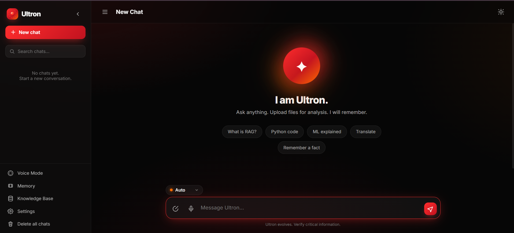
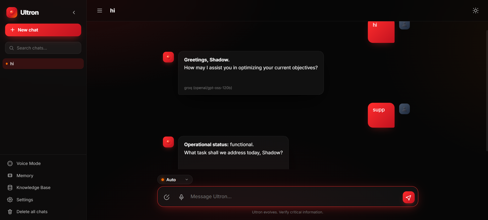
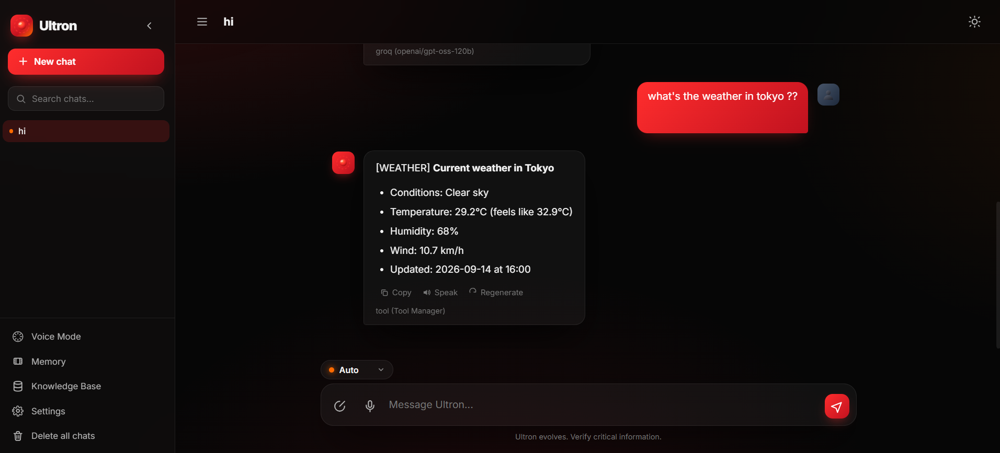
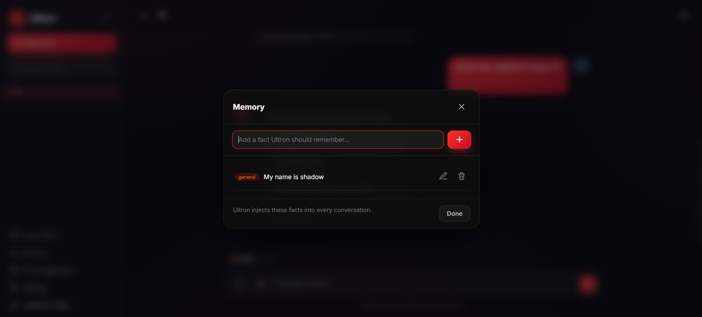
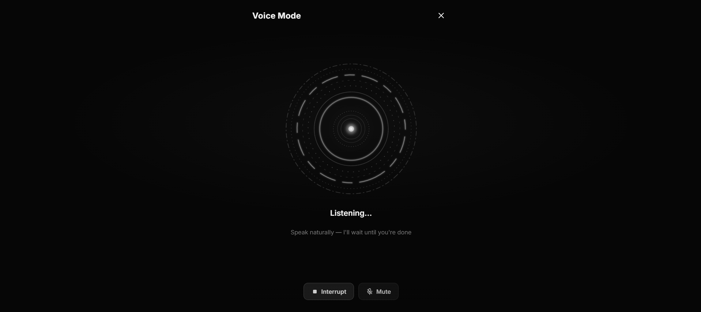
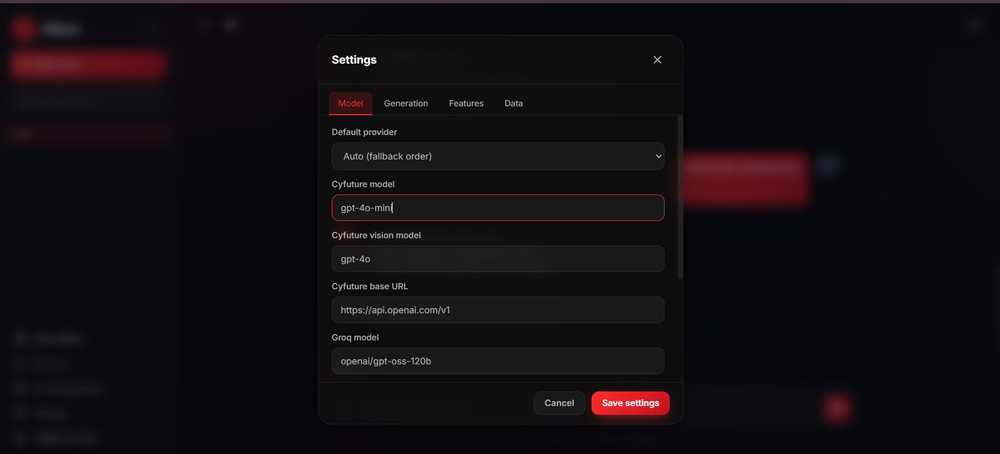

# Ultron AI Assistant ✦

A lightweight, premium-looking ChatGPT-style AI assistant that runs entirely on **localhost**.
Built with **Python (Flask)** and **vanilla HTML/CSS/JS** — no Node.js, no React, no heavy frontend framework.

Perfect for demonstrating AI / ML concepts in an internship project: **RAG**, **memory**, **multi-provider fallback**, **vision**, **speech (TTS/STT/STS)**, and **document analysis**.

---

## Features

- **Conversational AI** — programming, AI/ML, science, math, writing, summaries, translation, code.
- **Multiple AI providers with automatic fallback** — Cyfuture → Groq → Gemini. If the active provider fails, Ultron silently switches to the next one.
- **RAG (Retrieval Augmented Generation)** — upload PDF, DOCX, TXT, Markdown or CSV files; Ultron embeds them locally and answers only from the retrieved context (reduces hallucinations).
- **Image understanding** — PNG/JPG/JPEG/WEBP. Ultron reads text in images (via vision models + optional OCR), describes images, reads invoices, charts, screenshots and diagrams.
- **PDF & DOCX understanding** — extract text, tables, headings and answer questions.
- **Speech (TTS / STT / STS)** — **Text-to-Speech** (Edge Neural TTS, deep male voices, offline, no API key), **Speech-to-Text** (browser Web Speech API + Groq Whisper fallback), **Speech-to-Speech** (full-duplex Voice Mode: tap the orb, speak, get a spoken reply — continuous conversation with VAD + silence detection).
- **Long-term memory** (SQLite) — save facts ("My name is Rahul") and Ultron remembers them across chats. View / add / edit / delete from the UI, plus an auto-learn mode.
- **Short-term memory** — conversation history is replayed into each response.
- **Chat history** — create, rename, delete, search and restore chats, plus export/import as JSON.
- **Streaming responses** — markdown rendering, syntax-highlighted code, copy / regenerate / stop buttons.
- **Premium glassmorphism UI** — dark/light themes, glass panels, blur, smooth gradients, responsive down to mobile.
- **Settings** — API keys, model selection, temperature, max tokens, RAG/memory toggles, Voice selection (TTS), provider priority.

---

## Folder structure

```
ultron/
├── app.py                 # Flask app + all API routes + SSE streaming
├── requirements.txt
├── .env.example           # template for API keys
├── README.md
├── templates/
│   └── index.html         # single-page UI
├── static/
│   ├── css/style.css      # premium glassmorphism theme
│   └── js/app.js          # vanilla JS controller
├── database/
│   └── db.py              # SQLite schema + helpers (ultron.db is created here)
├── memory/
│   └── manager.py         # long-term memory CRUD + auto-learning
├── rag/
│   ├── core.py            # PDF/DOCX/TXT/MD/CSV extraction + chunking + embeddings + vector store
│   └── store.py           # embeddings + local vector search (SQLite + numpy)
├── models/
│   └── providers.py       # Cyfuture / Groq / Gemini + fallback
├── utils/
│   ├── logger.py          # console + file logging
│   ├── security.py        # upload validation & magic-byte checks
│   └── ocr.py             # optional Tesseract OCR
├── uploads/               # uploaded files stored here (with safe random names)
└── logs/                  # created automatically (ultron.log)
```

---

## Installation

Requires Python 3.10+.

```bash
# 1. create a virtual environment (recommended)
python -m venv venv
# Windows:
venv\Scripts\activate
# macOS / Linux:
source venv/bin/activate

# 2. install dependencies
pip install -r requirements.txt

# 3. (optional) add API keys
#    copy .env.example to .env and fill in your keys
```

### Optional extras

- **Tesseract OCR**: install [Tesseract](https://github.com/tesseract-ocr/tesseract) on your system and `pip install pytesseract`. Without it, image text is still read by the vision model.
- **RAG** needs `sentence-transformers`, which downloads a small model (~90 MB) on first use.

---

## Run

```bash
python app.py
```

Then open **http://127.0.0.1:5000** in your browser.

(You can also run with Flask: `flask --app app run`. The file-based entry point is preferred.)

---

## API keys setup

Get free keys from:

| Provider | Where | Priority |
|----------|-------|----------|
| Groq | https://console.groq.com | 1 (default, very fast) |
| Gemini | https://aistudio.google.com/app/apikey | 2 (vision) |

Add them to a `.env` file (see `.env.example`) — keys cannot be changed from the web UI. Ultron tries providers in order and falls back automatically if a key is missing or a request fails — you never see the failure.

---

## How it works

### 1. RAG pipeline

1. **Upload** a file (`+` button next to the input). PDFs/DOCX/TXT/MD/CSV are read by the extractors in `rag/core.py` and split into overlapping chunks.
2. Sentence embeddings are computed locally (`langchain-huggingface`, TF-IDF fallback) and stored in Qdrant (local fallback: SQLite) via `rag/core.py`.
3. When you ask a question, Ultron embeds your question, finds the most similar chunks in the chat's documents, and injects them into the system prompt as "relevant context".
4. The model answers from that context, which greatly reduces hallucinations.

### 2. Long-term memory

- Facts are stored in the SQLite `memory` table.
- When memory is enabled, all saved facts are injected into the system prompt of every conversation, so Ultron remembers them across sessions and chats.
- **Auto-learn**: when you say things like *"My name is Rahul"*, *"I work at ABC"* or *"remember that I like football"*, Ultron extracts and saves simple facts automatically (best-effort). You can always edit or delete them from the **Memory** screen.

### 3. Fallback

- The provider order comes from `models/providers.py` (`_PRIORITY`).
- `stream_with_fallback()` tries the active provider first; on **any** exception it logs the error, emits a `fallback` event, and continues with the next provider.
- As long as at least one provider is configured, the user gets an answer.

### 4. Short-term memory

- Every message is saved to the `messages` table per chat.
- The whole conversation is replayed into the model call, giving the assistant conversational context.

### 5. Image understanding

- Images are attached to the provider call as base64 (vision model on Gemini).
- Local OCR (`pytesseract`) text is also added to the prompt when available, making invoice/table/code reads accurate.

### 6. Voice — TTS / STT / STS

- **TTS** (Text-to-Speech): Edge Neural TTS (free, offline). Curated deep male voices (Christopher, Guy, Eric, Roger, Steffan, Ryan, Thomas, etc.) with adjustable pitch/rate. Default voice is Ultron-deep. No API key needed.
- **STT** (Speech-to-Text): Browser Web Speech API (Chrome/Edge/Opera) for real-time transcription. Fallback: **Groq Whisper** (`whisper-large-v3-turbo`) via `/api/voice/transcribe` for browsers without Web Speech API or when network is required. Audio captured as WebM/MP4, auto-converted to 16 kHz WAV, sent to Groq, transcript returned.
- **STS** (Speech-to-Speech / Voice Mode): Full-screen Voice Mode (ChatGPT-style). Tap the orb → **listening** (VAD + 1.8s silence auto-stop, visual live transcript). Ultron **thinks** → **speaks** (Edge TTS streams MP3, played in-browser). Interrupt anytime by tapping the orb again. Continuous conversation loop with configurable silence thresholds. Works in Chrome/Edge/Firefox.

---

## Quick Start — Voice Mode

1. Start Ultron: `python app.py` (or `docker compose up -d`)
2. Open `http://localhost:5000` in **Chrome/Edge** (Firefox works but no Web Speech API).
3. Click the **mic icon** in the bottom bar (Voice Overlay) or the **Voice Mode** button in the sidebar (mic icon with wave).
4. **Voice Overlay**: Tap the mic, speak, tap again — Ultron replies with TTS.
5. **Voice Mode** (full-screen): Tap the orb, speak naturally. Ultron listens until you pause (~1.8s), thinks, then speaks. Tap orb again to interrupt.
6. **Settings** > Features > **Speak voice** to change TTS voice. **Provider fallback** > enable for STT fallback.

---

## Screenshots

| Home | Chat |
|------|------|
|  |  |

| Weather tool | Memory |
|--------------|--------|
|  |  |

| Voice Mode | Settings |
|------------|----------|
|  |  |

---

## Security

- Uploads are validated against a whitelist of extensions and a 25 MB size cap.
- Image **magic bytes** are checked so renamed executables are rejected.
- Files are stored under `uploads/` with random UUID names (no path traversal).
- API keys live in environment variables (`python-dotenv`) or the local SQLite DB — never hard-coded.

## Logging

All events — errors, API failures, fallbacks, uploads, memory updates, settings changes — are written to `logs/ultron.log` and the console via `utils/logger.py`.

---

## Troubleshooting

- **"No readable text found"** on a PDF: it's a scanned image PDF. Upload the pages as PNG/JPG images instead — vision + OCR will read them.
- **RAG not answering from documents**: make sure you uploaded a document **inside the current chat** and that `RAG` is enabled in Settings.
- **Very slow first request**: the embedding model downloads on its first use.

## License

For educational / internship demonstration purposes.